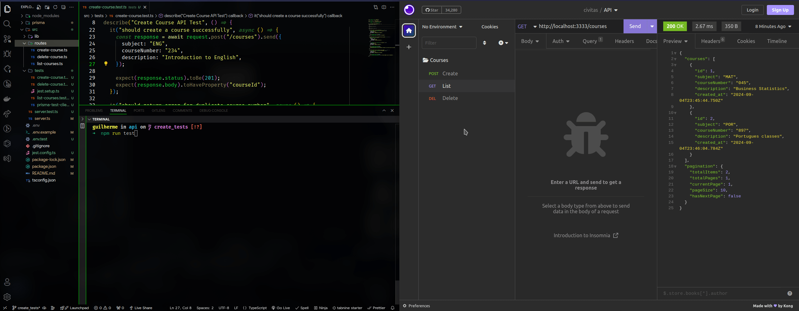

<h1 align="center">CIVITAS - API</h1>

## About this Project

This application allows users to manage course records. Built with a focus on simplicity, it has functionalities to add, search, and delete courses.
The application handles course details such as subject, course number (formatted as three-digit, zero-padded integer), and description. And it prevents the addition of duplicate courses and validates course numbers.

<!-- ## Project presentation

 -->

## Functionalities

- Primary

  - Search: Find courses by partial descriptions (e.g., "Bio" finds "Introduction to Biology").
  - Add/Delete: Easily add new courses or delete existing ones.
  - Validation: Ensures course number formatting and unique course entries.

## Used Techs

- Fastify: A highly performant and low-overhead web framework for Node.js, designed to help developers build fast and scalable web applications.
- Prisma:
- Zod:

# How to run the project

> Node version used: v20.9.0

> NPM version used: v10.1.0

## Application

```bash
# (1) Install project dependencies
npm install
```

```bash
# (2) Create a .env file in the root of the project, following exactly the example of the .env.example file
```

```bash
# (3) Initialize database
npx prisma migrate dev
```

```bash
# (4) Run the application on localhost -> http://localhost:3333
npm run dev
```

```bash
# You can view the database through Prisma Studio -> http://localhost:5555/
npx prisma studio
```

# Author

Made with 💚 by Guilherme Bafica 👋

[](https://www.linkedin.com/in/guilhermebafica/)
