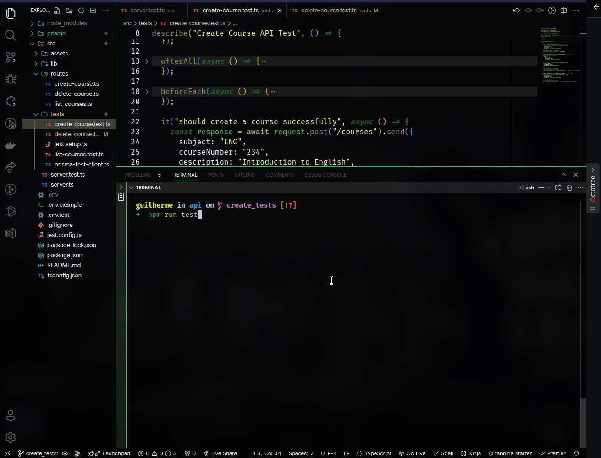

<h1 align="center">CIVITAS - API</h1>

## About this Project

This application allows users to manage course records. Built with a focus on simplicity, it has functionalities to add, search, and delete courses.
The application handles course details such as subject, course number (formatted as three-digit, zero-padded integer), and description. And it prevents the addition of duplicate courses and validates course numbers.

## Project presentation



## Functionalities

- Primary

  - Search: Find courses by partial descriptions (e.g., "Bio" finds "Introduction to Biology").
  - Add/Delete: Easily add new courses or delete existing ones.
  - Validation: Ensures course number formatting and unique course entries.

- Secondary

  - When listing courses, the application could include pagination functionality to improve navigation of longer course lists.
  - Unit tests of application routes.

## Used Techs

- Fastify: A highly performant and low-overhead web framework for Node.js, designed to help developers build fast and scalable web applications.
- Prisma: An open-source database toolkit that simplifies database management in Node.js and TypeScript applications.
- Zod: A TypeScript-first schema declaration and validation library.
- Jest: A testing framework designed for simplicity, performance, and support for a wide range of testing needs, such as unit, integration, and snapshot tests.
- Supertest: An HTTP assertions library that works with Node.js applications, allowing you to test APIs by simulating HTTP requests.

# How to run the project

> Node version used: v20.9.0

> NPM version used: v10.1.0

## Application

```bash
# (1) Install project dependencies
npm install
```

```bash
# (2) Create a .env file in the root of the project, following exactly the example of the .env.example file
```

```bash
# (3) Initialize database
npm run migrate
```

```bash
# (4) Run the application on localhost -> http://localhost:3333
npm run dev
```

```bash
# You can view the database through Prisma Studio -> http://localhost:5555/
npx prisma studio
```

```bash
# To test the application
npm run test
```

### Extra

I chose these technologies, such as SQLite for the database, with a focus on development speed, as this is just a test scenario. The advantage of using SQLite is that it requires no environment configuration, allowing for a complete test of the application in one go. Since I opted to use Prisma as the ORM, switching to a different database in the future would be easy. However, when thinking about scalability and a commercial project, I would likely choose technologies like GraphQL for better entity management and the ability to perform multiple operations at once using queries and mutations. And a PostgreSQL database.

Regarding the ID, I would prefer using a UUID format (for best practices and security), but technically, this is a string, and following the challenge information, "All fields other than id are strings," I opted for a simple auto-incrementing integer.

Although the focus was on the speed and simplicity of the project, I created a structure that follows best practices, ensuring clear separation of responsibilities and making it easily extensible for new features.

# Author

Made with 💚 by Guilherme Bafica 👋

[](https://www.linkedin.com/in/guilhermebafica/)
